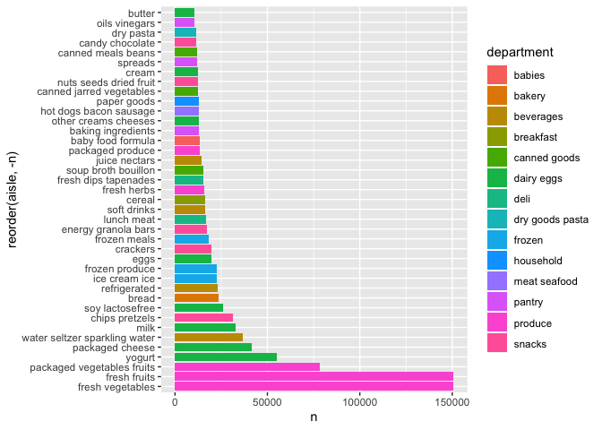

Data Science \! Homework 3
================
Charlotte Fowler
10/9/2019

``` r
library(tidyverse)
```

    ## ── Attaching packages ─────────────────────────────────────────────────── tidyverse 1.2.1 ──

    ## ✔ ggplot2 3.2.1     ✔ purrr   0.3.2
    ## ✔ tibble  2.1.3     ✔ dplyr   0.8.3
    ## ✔ tidyr   1.0.0     ✔ stringr 1.4.0
    ## ✔ readr   1.3.1     ✔ forcats 0.4.0

    ## ── Conflicts ────────────────────────────────────────────────────── tidyverse_conflicts() ──
    ## ✖ dplyr::filter() masks stats::filter()
    ## ✖ dplyr::lag()    masks stats::lag()

# Problem 1

``` r
library(p8105.datasets)
data("instacart")
```

The goal is to do some exploration of this dataset. To that end, write a
short description of the dataset, noting the size and structure of the
data, describing some key variables, and giving illstrative examples of
observations. Then, do or answer the following (commenting on the
results of each):

This dataset has 1384617 rows and 15 variables. Each row represents a
different item ordered by a instacart customer. We have information on
the order, such as `order_id`, `order_hour_of_day`, `order_dow` or the
day of week in which the order occured, and `add_to_cart_order` which
shows the order in which items were added to the cart. We also have
information on the customer such as `user_id`, `order_number` or the
number of prior orders (+1) this customer has had, and
`days_since_prior_order`. Lastly we have information on the product
being requested such as `product_id`, `product_name`, `aisle_id`,
`aisle`, `department_id`, and `department`.

For example, we know that customer 127134, in their 10th order from
instacart, on a Friday at 9am added ‘Hash Brown Potato Patties’, in
frozen appetizers sides aisle from the frozen department, for the first
time as the 21st item in their cart. We can also see that 19 other
orders in the data contained ‘Hash Brown Potato Patties’.

``` r
instacart %>% 
  filter(product_name == 'Hash Brown Potato Patties') %>% 
  nrow()
```

How many aisles are there, and which aisles are the most items ordered
from?

``` r
instacart %>% 
  group_by(aisle) %>% 
  count() %>% 
  nrow() 
```

    ## [1] 134

``` r
instacart %>% 
  group_by(aisle) %>% 
  count() %>% 
  nrow()
```

    ## [1] 134

``` r
instacart %>% 
  group_by(aisle) %>% 
  count() %>% 
  arrange(-n) %>% 
  filter(n>70000)
```

    ## # A tibble: 3 x 2
    ## # Groups:   aisle [3]
    ##   aisle                           n
    ##   <chr>                       <int>
    ## 1 fresh vegetables           150609
    ## 2 fresh fruits               150473
    ## 3 packaged vegetables fruits  78493

There are 134 aisles. The most popular are fresh vegetables, fresh
fruits, and packaged vegetables fruits.

Make a plot that shows the number of items ordered in each aisle,
limiting this to aisles with more than 10000 items ordered. Arrange
aisles sensibly, and organize your plot so others can read it.

``` r
instacart %>% 
  group_by(aisle) %>% 
  count() %>% 
  filter(n>10000) %>% 
  inner_join (instacart, by = 'aisle') %>% 
  select(aisle, n, department) %>% 
  distinct() %>% 
  arrange(-n) %>% 
  ggplot(aes(x = reorder(aisle, -n), y = n, fill = department)) +
  geom_bar(stat = "identity") +
  coord_flip() 
```

<!-- -->

Make a table showing the three most popular items in each of the aisles
“baking ingredients”, “dog food care”, and “packaged vegetables
fruits”. Include the number of times each item is ordered in your
table.

``` r
instacart %>% 
  filter(aisle == c("baking ingredients", "dog food care", "packaged vegetables fruits" )) %>% 
  select(product_name, aisle) %>%   
  group_by(aisle, product_name) %>% 
  count()
```

    ## # A tibble: 1,114 x 3
    ## # Groups:   aisle, product_name [1,114]
    ##    aisle              product_name                                        n
    ##    <chr>              <chr>                                           <int>
    ##  1 baking ingredients 1 to 1 Gluten Free Baking Flour                     5
    ##  2 baking ingredients 1-to-1 Baking Flour, Gluten/Wheat/Dairy Free        2
    ##  3 baking ingredients 100% Cacao Unsweetened Chocolate Baking Bar         3
    ##  4 baking ingredients 100% Natural Sweetener Zero Calorie Packets        16
    ##  5 baking ingredients 100% Natural Zero Calorie Sweetener                 2
    ##  6 baking ingredients 100% Organic Einkorn  All-Purpose Flour             2
    ##  7 baking ingredients 100% Organic Premium Whole Wheat Flour              2
    ##  8 baking ingredients 100% Organic Unbleached All-Purpose Flour           8
    ##  9 baking ingredients 100% Organic Unbleached White Whole Wheat Flour     1
    ## 10 baking ingredients 100% Pure Corn Starch                              22
    ## # … with 1,104 more rows

Make a table showing the mean hour of the day at which Pink Lady Apples
and Coffee Ice Cream are ordered on each day of the week; format this
table for human readers (i.e. produce a 2 x 7 table).

``` r
instacart %>% 
  filter(product_name == c('Pink Lady Apples', 'Coffee Ice Cream')) %>% 
  select(order_hour_of_day, order_dow, product_name) %>% 
  group_by(order_dow, product_name) %>% 
  summarize(mean(order_hour_of_day)) %>% 
  pivot_wider(names_from = product_name, values_from = 'mean(order_hour_of_day)') %>% 
  ungroup() %>% 
  rename(
    Day = order_dow, 
    'Coffee Ice Cream: Mean Hour Ordered' = 'Coffee Ice Cream', 
    'Pink Lady Apples: Mean Hour Ordered' = 'Pink Lady Apples'
  ) %>% 
  mutate(
    Day = recode(Day, '0' = "Monday", '1' = "Tuesday", '2'="Wednesday", '3'="Thursday", '4'="Friday", '5'="Saturday", '6'="Sunday"), 
  ) %>% 
  knitr::kable()
```

    ## Warning in product_name == c("Pink Lady Apples", "Coffee Ice Cream"):
    ## longer object length is not a multiple of shorter object length

| Day       | Coffee Ice Cream: Mean Hour Ordered | Pink Lady Apples: Mean Hour Ordered |
| :-------- | ----------------------------------: | ----------------------------------: |
| Monday    |                            13.22222 |                            12.25000 |
| Tuesday   |                            15.00000 |                            11.67857 |
| Wednesday |                            15.33333 |                            12.00000 |
| Thursday  |                            15.40000 |                            13.93750 |
| Friday    |                            15.16667 |                            11.90909 |
| Saturday  |                            10.33333 |                            13.86957 |
| Sunday    |                            12.35294 |                            11.55556 |
