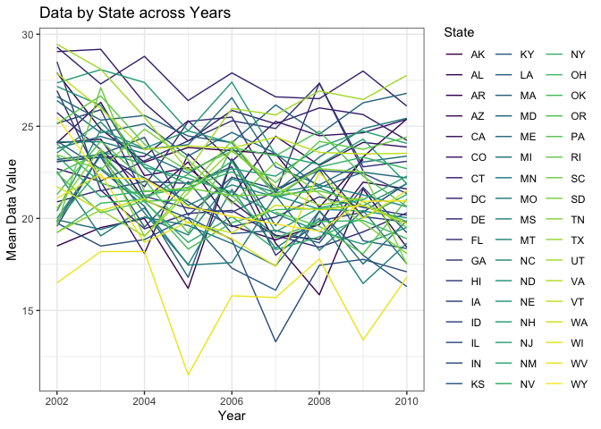
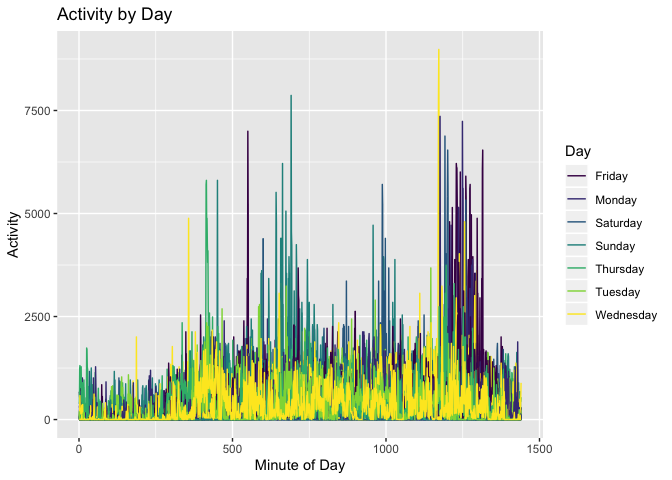

Homework 3
================
Charlotte Fowler
10/9/2019

``` r
#load packages used
library(tidyverse)
```

    ## ── Attaching packages ──────────────────────────────────────────────────────── tidyverse 1.2.1 ──

    ## ✔ ggplot2 3.2.1     ✔ purrr   0.3.2
    ## ✔ tibble  2.1.3     ✔ dplyr   0.8.3
    ## ✔ tidyr   1.0.0     ✔ stringr 1.4.0
    ## ✔ readr   1.3.1     ✔ forcats 0.4.0

    ## ── Conflicts ─────────────────────────────────────────────────────────── tidyverse_conflicts() ──
    ## ✖ dplyr::filter() masks stats::filter()
    ## ✖ dplyr::lag()    masks stats::lag()

``` r
library(p8105.datasets)
```

# Problem 1

``` r
#load data
data("instacart")
```

This dataset has 1384617 rows and 15 variables. Each row represents a
different item ordered by a instacart customer. We have information on
the order, such as `order_id`, `order_hour_of_day`, `order_dow` or the
day of week in which the order occured, and `add_to_cart_order` which
shows the order in which items were added to the cart. We also have
information on the customer such as `user_id`, `order_number` or the
number of prior orders (+1) this customer has had, and
`days_since_prior_order`. Lastly we have information on the product
being requested such as `product_id`, `product_name`, `aisle_id`,
`aisle`, `department_id`, and `department`.

For example, we know that customer 127134, in their 10th order from
instacart, on a Friday at 9am added ‘Hash Brown Potato Patties’, in
frozen appetizers sides aisle from the frozen department, for the first
time as the 21st item in their cart. We can also see that 19 other
orders in the data contained ‘Hash Brown Potato Patties’.

``` r
#searching for Hash Brown Potato Patties in dataset
instacart %>% 
  filter(product_name == 'Hash Brown Potato Patties') %>% 
  nrow()
```

``` r
#counting number of aisles
instacart %>% 
  group_by(aisle) %>% 
  count() %>% 
  nrow() 
```

    ## [1] 134

``` r
#finding top four most popular aisles 
instacart %>% 
  group_by(aisle) %>% 
  count() %>% 
  arrange(-n) %>% 
  .[0:4,] %>% 
  knitr::kable()
```

| aisle                      |      n |
| :------------------------- | -----: |
| fresh vegetables           | 150609 |
| fresh fruits               | 150473 |
| packaged vegetables fruits |  78493 |
| yogurt                     |  55240 |

There are 134 aisles. The most popular are fresh vegetables, fresh
fruits, packaged vegetables fruits, and yogurt.

``` r
#Building bar chart of most popular aisles 
instacart %>% 
  group_by(aisle) %>% 
  count() %>% 
  filter(n>10000) %>% 
  inner_join (instacart, by = 'aisle') %>% 
  select(aisle, n, department) %>% 
  distinct() %>% 
  arrange(-n) %>% 
  ggplot(aes(x = reorder(aisle, -n), y = n, fill = department)) +
  geom_bar(stat = "identity") +
  coord_flip() +
  labs(title = "Most Popular Aisles", y = "Number of Orders", x = "Aisle")
```

<!-- -->

Produce aisles appear the most popular, followed by some dairy and eggs
aisles. There are a few aisles such as fresh vegetables and fruits which
have far more orders than any others.

``` r
#picking top 3 products from baking aisle
baking_aisle = instacart %>% 
  filter(aisle == "baking ingredients") %>%
  select(product_name, aisle) %>%   
  group_by(aisle, product_name) %>% 
  count() %>% 
  arrange(-n) %>%
  .[0:3,]

#picking top 3 products from dog aisle
dog_aisle = instacart %>% 
  filter(aisle == "dog food care") %>%
  select(product_name, aisle) %>%   
  group_by(aisle, product_name) %>% 
  count() %>% 
  arrange(-n) %>%
  .[0:3,]

#picking top 3 products from veg aisle
veg_aisle = instacart %>% 
  filter(aisle == "packaged vegetables fruits") %>%
  select(product_name, aisle) %>%   
  group_by(aisle, product_name) %>% 
  count() %>% 
  arrange(-n) %>%
  .[0:3,]
```

``` r
#binding 3 tables together and cleaning
three_aisles = 
  bind_rows(baking_aisle, dog_aisle, veg_aisle) %>% 
  rename(
    "Top Products" = product_name, 
    "Aisle" = aisle,
    "Number of Orders" = n
    ) 

knitr::kable(three_aisles)
```

| Aisle                      | Top Products                                  | Number of Orders |
| :------------------------- | :-------------------------------------------- | ---------------: |
| baking ingredients         | Light Brown Sugar                             |              499 |
| baking ingredients         | Pure Baking Soda                              |              387 |
| baking ingredients         | Cane Sugar                                    |              336 |
| dog food care              | Snack Sticks Chicken & Rice Recipe Dog Treats |               30 |
| dog food care              | Organix Chicken & Brown Rice Recipe           |               28 |
| dog food care              | Small Dog Biscuits                            |               26 |
| packaged vegetables fruits | Organic Baby Spinach                          |             9784 |
| packaged vegetables fruits | Organic Raspberries                           |             5546 |
| packaged vegetables fruits | Organic Blueberries                           |             4966 |

The packaged vegetables fruits aisle’s top products have far more orders
than the other two. The top dog food care products still have relatively
few orders.

``` r
#making table of apples and ice cream and time ordered
instacart %>% 
  filter(product_name %in% c('Pink Lady Apples', 'Coffee Ice Cream')) %>% 
  select(order_hour_of_day, order_dow, product_name) %>% 
  group_by(order_dow, product_name) %>% 
  summarize(mean_hour = round(mean(order_hour_of_day), digits = 2)) %>% 
  pivot_wider(names_from = product_name, values_from = 'mean_hour') %>% 
  ungroup() %>% 
  rename(Day = order_dow,
         'Pink Lady Apple: mean hour' ='Pink Lady Apples',
         'Coffee Ice Cream: mean hour' = 'Coffee Ice Cream'
         ) %>% 
  mutate(
    Day = recode(Day, '0' = "Monday", '1' = "Tuesday", '2'="Wednesday", '3'="Thursday", '4'="Friday", '5'="Saturday", '6'="Sunday"), 
  ) %>% 
  knitr::kable() 
```

| Day       | Coffee Ice Cream: mean hour | Pink Lady Apple: mean hour |
| :-------- | --------------------------: | -------------------------: |
| Monday    |                       13.77 |                      13.44 |
| Tuesday   |                       14.32 |                      11.36 |
| Wednesday |                       15.38 |                      11.70 |
| Thursday  |                       15.32 |                      14.25 |
| Friday    |                       15.22 |                      11.55 |
| Saturday  |                       12.26 |                      12.78 |
| Sunday    |                       13.83 |                      11.94 |

People appear to order their ice cream later in the day than apples. In
general the apples are typically ordered around 11 am, and the ice cream
is ordered around 2 pm. Orders on the weekend appear to be earlier than
orders on the weekdays.

# Problem 2

``` r
#reading in data
data("brfss_smart2010")


#data cleaning for brfss
brfss_smart2010 = brfss_smart2010 %>% 
  janitor::clean_names() %>% 
  separate(locationdesc, 
           into = c('state', 'county'),
           sep = " - ") %>% 
  select(-locationabbr) %>% 
  filter(
    topic == 'Overall Health',
    response %in%  c('Excellent', 'Good', 'Very good', 'Fair', 'Poor')
  ) %>% 
  mutate(response = forcats::fct_relevel(response, c("Poor", "Fair", "Good", "Very good", "Excellent")))
```

``` r
#calculating states with 7+ locations in 2002
brfss_smart2010 %>% 
  filter(
    year==2002
  ) %>% 
  select(state, county) %>% 
  distinct() %>% 
  count(state) %>% 
  filter(n>=7) %>% 
  knitr::kable() 
```

| state |  n |
| :---- | -: |
| CT    |  7 |
| FL    |  7 |
| MA    |  8 |
| NC    |  7 |
| NJ    |  8 |
| PA    | 10 |

``` r
#calculating states with 7+ locations in 2010
brfss_smart2010 %>% 
  filter(
    year==2010
  ) %>% 
  select(state, county) %>% 
  distinct() %>% 
  count(state) %>% 
  filter(n>=7) %>% 
  knitr::kable() 
```

| state |  n |
| :---- | -: |
| CA    | 12 |
| CO    |  7 |
| FL    | 41 |
| MA    |  9 |
| MD    | 12 |
| NC    | 12 |
| NE    | 10 |
| NJ    | 19 |
| NY    |  9 |
| OH    |  8 |
| PA    |  7 |
| SC    |  7 |
| TX    | 16 |
| WA    | 10 |

In 2002, Conneticut, Florida, Massachusetts, North Carolina, New Jersey
and Pennsylvania were observed at 7 or more locations. In 2010,
California, Colorado, Florida, Massachusetts, Maryland, North Carolina,
Nebraska, New Jersey, New York, Ohio, Pennsylvania, South Carolina,
Texas and Washington were observed in 7 or more
locations.

``` r
#creating new data set with mean values per year, and making spaghetti plot
brfss_smart2010 %>% 
  filter(response == 'Excellent') %>% 
  group_by(state, year) %>% 
  summarize(mean_value = mean(data_value)) %>% 
  ggplot(
    aes(x = year, y = mean_value, color = state)) +
  geom_line() + 
  labs(x = 'Year', y = 'Mean Data Value', title = 'Data by State across Years') + 
  viridis::scale_color_viridis(
    discrete = TRUE, 
    name = "State"
    ) +
  theme_bw() 
```

<!-- -->

Some states appear to have much higher mean values compared to others.
Additionally, some states are very fluctual, while others have
relatively stable mean values across time. In most states the mean value
appears to have risen around 2006, and fallen shortly after.

``` r
#making 2 panel bar graph 
brfss_smart2010 %>% 
  filter(
    year %in% c(2006, 2010), 
    state == 'NY'
  ) %>% 
  ggplot(aes( x = response, y = data_value)) + 
  geom_bar(stat = "identity") + 
  facet_grid(~year) + 
  labs(title = "New York 2006 and 2010 Responses", x = "Response", y = "Data Value")
```

<!-- -->

The values appear higher in all categories in 2010 compared to 2006. In
both years, there are higher values on the positive versus negative
responses. Very good in both years was the highest response.

# Problem 3

``` r
#tidying the data
accel_data = read_csv("./data/accel_data.csv")
```

    ## Parsed with column specification:
    ## cols(
    ##   .default = col_double(),
    ##   day = col_character()
    ## )

    ## See spec(...) for full column specifications.

``` r
accel_data = accel_data %>% 
  pivot_longer(
    'activity.1':'activity.1440',
    values_to = 'activity', 
    names_to = 'minute'
  ) %>% 
  separate(minute, 
           into = c('non', 'minute'),
           sep = 9) %>% 
  select(-non) %>% 
  mutate(
    weekend = ifelse(day == c("Sunday", "Saturday"), TRUE, FALSE ),
    minute = as.numeric(minute),
    day = factor(day),
    week = factor(week)
  )
```

The dataset `accel_data` consists of 50400 observations by 6 variables.
Each observation represents a minute of data observed by the
accelerometer. We have information on the `minute`, `day`, and `week`,
as well as a logical variable on whether it was the `weekend`. We also
have information on `day.id`, or how many days the patient has been
wearing the device. Lastly, we have the `activity` count for that
minute.

``` r
#looking at sum for each day
accel_data %>% 
  group_by(day_id) %>% 
  summarize(activity_sum =(sum(activity))) 
```

    ## # A tibble: 35 x 2
    ##    day_id activity_sum
    ##     <dbl>        <dbl>
    ##  1      1      480543.
    ##  2      2       78828.
    ##  3      3      376254 
    ##  4      4      631105 
    ##  5      5      355924.
    ##  6      6      307094.
    ##  7      7      340115.
    ##  8      8      568839 
    ##  9      9      295431 
    ## 10     10      607175 
    ## # … with 25 more rows

It appears that on weekends the individual was either occasionally much
less active, or would not wear the device. For example on Saturday, the
24, and Saturday the 31st, the there is practically no activity.
Activity appears much more consistent during the week, and more variable
on weekends.

``` r
#making graoh with activity across each day
accel_data %>% 
  ggplot(aes(x = minute, y = activity, group = day_id, color = day)) +
  geom_line(size = 0.5) +
  viridis::scale_color_viridis(
    discrete = TRUE, 
    name = "Day"
    ) + 
  labs(title = "Activity by Day", x = "Minute of Day", y = "Activity")
```

<!-- -->

The most active period of the day is aroun minute 1250, or around 8 PM.
The individual was least active from about 10 PM to 3 AM. There were
occasional peaks of activity around lunchtime and 4 PM. The inidividual
appears slightly more active on the weekend versus weekdays.
